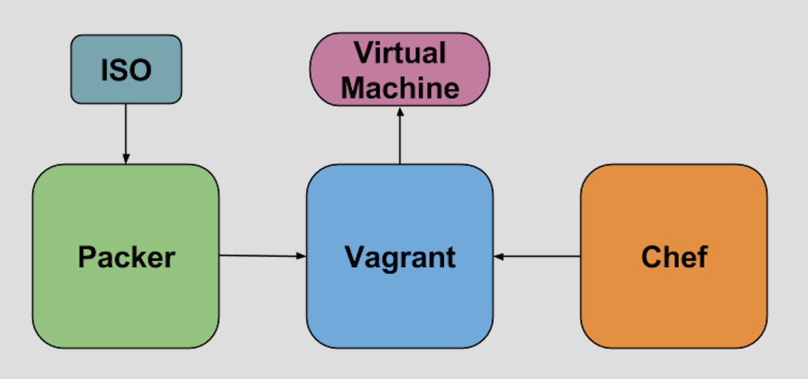
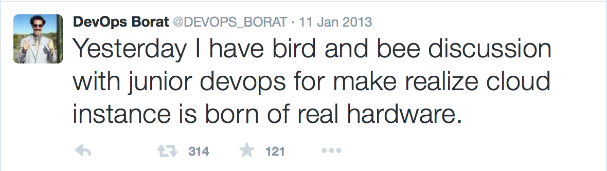

## Build, development and test environments as code

**Ryan Larson**

Software Engineer, Tripwire

--new-slide--

## Environments

   * Environmental problems at Tripwire
   * Solutions with DevOps tools

Note:
   * Tripwire problems are probably common

--page-break--

## Environments - problems

Note:
   * Our environments are all snowflakes
   * A lot of variance between environments
   * Variances cause problems and difficult to see

--page-break--

## Development environments

Note:
   * Onboarding
   * Working on inactive projects - Installers
   * Working around barriers - people problem
   * Setting up a development environment for working on something you aren't used to can be costly

--page-break--

## Manual test environments

Note:
   * Duplicated work
   * Environmental variance makes troubleshooting difficult
   * I cannot begin to think how much time Tripwire has spent installing operating systems for testing
   * We are paying really smart engineers lots of money to install software, that is insane!
   * Wasted time for non bugs because of environmental variance (i.e. java version)

--page-break--

## Build and Continuous integration test environments

Note:
   * Build & Continuous integration environments are managed by a different team
   * Difficult to troubleshoot problems that only appear in these environments
   * Environmental problems make test automation less valuable
   * Some tests ONLY run in continuous integration because they are too expensive to set up

--page-break--

## Reproducibility

Note:
   * Builds are not truly reproducible because the environments used to develop, test, and build them
     change over time.
   * Scenario: Customer escalation for a product from 2 releases ago needs a hotfix. How do we have confidence
      in a surgical fix
      * When the developer checks out the code, will it still build?
      * Will the automated tests in continuous integration still run?
         * Do we still have the resources required for the tests to run?
      * Will the build agent still build it correctly?
      * How much confidence do we really have in this "surgical" fix considering everything that has changed

--page-break--

## Reproducibility - AIX horror story

   * Patch was pulled from release because an environmental change caused the AIX agent to recompile

Note:
   * Nothing was changed about AIX, so nobody thought we needed to test it
   * This wasn't even a hotfix, we had more time but it still wasn't enough
   * Release was pulled from web
   * Customer complaint alerted us to the problem
   * Difficult to figure out what happened
   * Difficult to figure out how to fix it

--page-break--

## Failed solutions

Note:
   * Documenting manual steps
      * Goes stale
   * VM templates
      * Too much disk, template sprawl
      * Difficult to accurately describe everything about the state
      * Not composable
   * Writing our own configuration management
      * This is fricking hard
      * Very difficult to get people to share it
      * Poor sharable design
         * Often automation is designed to address a specific problem
         * Again, not composable
      * Too many technologies
      * NIH syndrome - people problem

--new-slide--

## Automate Development, test, and build environments with DevOps tools

Note:
   * Propose that we can solve these problems by defining development, test, and build environments
      using DevOps tools
   * Not going to prescribe specific tools, but I will tell you a little bit about the tools that we use and
   how they fit into our workflows.

--page-break--

## Configuration management - Chef

Note:
   * Chef is all about taking a system and applying some configuration to it.
   * More than anything, Chef provides a framework for environment automation.
   * When everybody is using the same framework, it makes things much easier to share
   * Declarative model
   * Written in ruby
   * Package management built in (cookbooks)
      * Think Java Jar, Ruby Gem, Python Egg
   * Dependency management built in
   * Very similar to Rubygems/Bundler
   * Chef doesn't know or care that it is running on a VM
   * Large community of open source cookbooks
      * Easier to get buy in from the organization because you get a lot for free
   * All code, all versioned

--page-break--

## VM Deployment - Vagrant

Vagrant can deploy a VM to almost any VM provider, and optionally kick off a configuration management tool
once the VM is up.

Note:
   * VMs compatible with Vagrant packaged as box files
   * Large community of people who make lots of different boxes available for free
   * All code, all versioned
   * Distinctions between tools - feature creep

--page-break--

## Vagrant box creation - Packer

Packer is a tool that can take a bare ISO and make it suitable for use with Vagrant

Note:
   * It can do a lot more, but for the purposes of this talk, this is all that matters
   * Packer templates are just JSON files that describe what packer should do with the ISO
      * They are platform dependent (i.e. Kickstarter and Preseed files)

--page-break--

## All together now

Note:
   * Packer takes an ISO as input and outputs a Vagrant compatible box
      * Vagrant takes the box as well as Chef cookbooks as input, and creates a VM from the box that has the configuration
      specified by the Chef cookbooks
   * Packer builds are done in Continuous Integration and the Vagrant Boxes are treated as artifacts just like any
      other software
   * Builds for Chef cookbooks are also done in continuous integration and the cookbooks are treated as artifacts
      just like any other software
   * Vagrantfiles are checked in to source control and consume/put together the output from the Chef and Packer builds

--new-slide--

## A new hope

We can use DevOps tools to version our Development, Test, and Build environments by defining them as code!

Note:
   * Here is how we can address the problems with our environments using DevOps tools

--page-break--

## Development environments

A working development environment can be checked in with the source code!

Note:
  * What about it going stale?
     * It has tests too that run with the build!
  * No longer afraid to work on installers!
  * New developers are productive on day 1!
     * Obviously they will probably customize these environments, but they don't have to
  * Developers don't have to be intimately familiar with everything in the toolchain to be productive

--page-break--

## Manual test environments

Note:
   * Way less duplicated effort
      * Test environments can be stood up in minutes
   * No more spending hours troubleshooting problems due to variances in environments
      * Everybody has the same test environment!
   * When we define the test environments as code, everybody knows they are working in the same environment.
   * Much easier for newer QA engineers to be productive, since they don't have to get tripped up on all of
   the configuration gotchas.

--page-break--

## Build and Continuous integration test environments

Note:
   * Build and Continuous integration test environments are defined as code
   * Any external dependencies of the tests are defined as code
      * Maybe even stood up by the test!
   * Again, this is all versioned along side the code it is designed to test
   * What about it going stale?
      * If the CI build fails because of an environmental problem, that is just treated as a test failure that will
         get fixed just like any other test failure
   * All tests can be run from a developer box because a script sets up the environment
   * Easier test development

--page-break--

## Reproducibility

Note:
   * Using DevOps tools gives us the ultimate in reproducibility
   * **patch/hotfix process**
   * Spin up the development environment
   * Make the change
      * Local build/tests
   * Spin up manual test environments on whatever operating systems
      * Perform the tests
   * Spin up the Continuous integration test environment along with any dependencies of the tests
      * Run the tests
   * Spin up the Production build environment
      * Do the build

--page-break--

## Resource conservation

We get all this while using less resources!

Note:
   * Environments are expensive to stand up, so they are kept around
   * Not shared very much though, everybody has their own
   * When environments are cheap to create, they can go away

--new-slide--

Ryan Larson

https://github.com/rylarson

@ryrylarson
