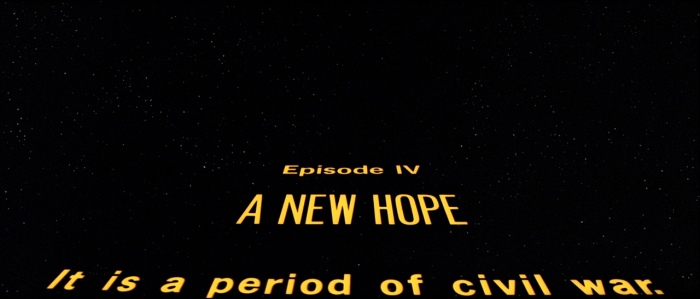

## Build, development and test environments as code

**Ryan Larson**

Software Engineer, Tripwire

--new-slide--

## Story time

Tripwire Story of test automation

Note:
   * Telling this story to tell you another story
   * Evolution of relationship between QA and Development is similar to evolution of relationship
   between Development and Operations
   * Evolution of test automation is similar to evolution of environment automation
   * I think we are at the same crossroads with environment automation

--page-break--

## Story time - The beginning

Old school software development

Separate development and QA silos

Note:
   * This was bad
   * QA gets involved too late when bugs are costly to fix, especially if they are a product of the basic design
   TODO look up more reasons this was bad

--page-break--

## Story time - Scrum culture

Developers and QA coexist on Scrum teams that are now
responsible for their own Development and QA.

Note:
   * This is good
   * QA gets involved early, finds bugs.
   * Bugs are cheaper to fix because developers have context when the bugs are found
   * Tripwire always did 'agile'. The culture shift is what took time. Scrum processes helped
      * The culture shift is what was important and what was hard.
   * People problem solved
   * Teams feel shared ownership of both development and QA

--page-break--

## Story Time - Test automation

Scrum blurred the lines between development and QA. At the same time, the industry as a whole was making a shift towards
automating lots of tests.

Note:
   * Automation further blurred the lines between dev and QA.
      * Developers were picking up QA 'development' tasks and QA was developing software to test software.

--page-break--

## Story Time - Test automation

Test automation is valuable

TODO tie this into value add of codifying environments as code. At any time, test, development, and build environments
 can be reproduced with confidence that the exact same bits are built.

Note:
   * The company as a whole sees the shift towards more automation as extremely valuable
      * At the end of the day, nothing will succeed unless it has value
   * The value add promise of automation is that a developer can make a change, run the tests, and if they pass, they know
     they didn't break anything
   * This change empowered developers to find many of the bugs before things got to QA.
   * Allowed developers to have greater confidence in their code and be more autonomous

   TODO empowering developers with automated tests is the same as empowering them with automated environments

--page-break--

## Story Time - It wasn't easy...

Automation is a culture problem too

Note:
   * Some teams were naturally better at automation than others
   * Business takes top down approach to make automation skill set available to all teams
        * Forms Performance & Automation team
   * Ineffective, why? Because it is the same situation as the rest of QA was prior to the agile shift
        * Perf bugs found late in cycle, Perf team doesn't get a hold of the code quick enough
   * Changing culture is hard :(
      * Even with embedding perf team members, didn't really work because the automation **culture** wasn't baked into the team
         * Culture is much harder to change, doesn't happen from the top down
            * Lots of push back from developers (we have to specialize!)
   * Developers and QA both cry "We have to specialize" as the job roles start to have more overlap.

--page-break--

## Story Time - But we did it

Driven by industry shifts, better tools, and better processes, we eventually got it.

Note:
   * It took time, but the culture shifted
   * Common tool sets allowed teams to share best practices, even share code
   * Industry as a whole highlighted the value
      * Test automation as a practice matured across the industry
   * Not specializing didn't hurt anybody!
   * Job roles overlapping helped interpersonal relationships since the team
   gets to work on more together.

--page-break--

## Story time - The end

Note:
   * I told you that story so I can tell you another story
   * The next story that I am about to tell you is still evolving, but it starts in much the same way
     as the last one did
   * There was a lot of time and energy spent changing practices and changing minds... MORE HERE

--new-slide--

## Environments

   * Environmental problems
   * Failed solutions
   * Solutions with DevOps tools

--page-break--

## Environments - problems

Note:
   * Our environments are all snowflakes

--page-break--

## Development environments

Note:
   * Developers take a long time to come onboard because they spend a lot of time setting up their environment
      * Every development environment is a snowflake, which is fine
      * Lots of common stuff though
         * Required libraries
         * Required software (java, build system, ruby, rvm, whatever)
         * Common gotchas that take thrashing with other developers to figure out
   * There is great value in having a reference development environment that works
   * Setting up a development environment for working on weird stuff can be really costly
      * Nobody wants to touch the installers because it is costly! So we work around it.
   * Setting up a development environment for working on something you aren't used to can be costly

--page-break--

## Manual test environments

   * Duplicated work
   * Environmental variance makes troubleshooting difficult

Note:
   * I cannot begin to think how much time Tripwire has spent installing operating systems for testing
   * We are paying really smart engineers lots of money to install software, that is insane!
   * Duplicated (or triplicated) work
      * Developers create environments to test their changes
      * QA creates more environments to test changes

--page-break--

## Continuous integration test environments

   * Continuous integration environments are managed by a different team
   * Environmental problems make test automation less valuable
   * Automated tests often depend on external resources that are manually created and maintained

Note:

   * Problems:
      * Difficult and expensive to troubleshoot problems that only appear on the build agents (not on dev boxes)
      * Developers have a hard time maintaining the automated tests since automation is often dependent
         on external resources that are expensive or impossible to replicate
      * Often test changes can only really be tested in production

--page-break--

## Build environments - Reproducibility

Note:
   * Problems:
      * Many of the same problems as the Continuous Integration environments
      * Difficult and expensive to troubleshoot problems that only appear on the build agents (not on dev boxes)
   * The state of the build environments change over time.
   * Builds are not truly reproducible because the environments used to develop, test, and build them
      change over time.
   * Scenario: Customer escalation for a product from 2 releases ago needs a hotfix. How do we have confidence
      that nothing else changed besides our fix?
      * When the developer checks out the code, will it still build?
      * Can we still stand up the automated tests for that release?
         * Will they still pass?
      * Will the build agent still build it correctly?

--page-break--

## Reproducibility - Build agent horror story

   * Patch was pulled from release because an environmental change caused the AIX agent to recompile

## Failed solutions

That sounds horrible, why would you put up with that?

It's not that we didn't try...

Note:
   * VM templates
      * Too much disk, template sprawl
      * Difficult to accurately describe everything about the state
      * Not composable
   * Writing our own configuration management
      * This is fricking hard
      * Very difficult to get people to share it
      * Poor sharable design
         * Often automation is designed to address a specific problem
         * Again, not composable
      * NIH syndrome - people problem

--new-slide--

## Automate Development, test, and build environments with DevOps tools

Note:
   * Propose that we can solve these problems by defining development, test, and build environments
      using DevOps tools
   * Not going to prescribe specific tools, but I will tell you what we use

--page-break--

## Configuration management - Chef

Chef is all about taking a system and applying some configuration to it.

Note:
   * The normal use case is to take a newly installed operating system and put it into the appropriate state
   for development and test.
   * Written in ruby
   * Package management built in (cookbooks)
      * Think Java Jar, Ruby Gem, Python Egg
   * Dependency management built in
   * Very similar to Rubygems/Bundler
   * Chef doesn't know or care that it is running on a VM

--page-break--

## VM Deployment - Vagrant

Vagrant can deploy a VM to almost any VM provider, and optionally kick off a configuration management tool
once the VM is up.

Note:
   * VMs compatible with Vagrant packaged as box files
   * Be careful, box files can be very snowflakey too!

--page-break--

## Vagrant box creation - Packer

Packer is a tool that can take a bare ISO and make it suitable for use with Vagrant

Note:
   * It can do a lot more, but for the purposes of this talk, this is all that matters
   * Packer templates are just JSON files that describe what packer should do with the ISO
      * They are platform dependent (i.e. Kickstarter and Preseed files)

--page-break--

## What about the failed solutions?

Note:
   * More than anything, Chef provides a framework for environment automation.
   * Before we had problems because of the mix of language choice, other technologies, and design.
   * When everybody is using the same framework, it makes things much easier to share
   * Chef solves a lot of common problems for us too, like package and dependency management.
   * There is great incentive for people not to roll their own since Chef gives us so many things for free
      from the community site.

--page-break--

## All together now

   * Packer takes an ISO as input and outputs a Vagrant compatible box
   * Vagrant takes the box as well as Chef cookbooks as input, and creates a VM from the box that has the configuration
   specified by the Chef cookbooks

Note:
   * In practice
      * Packer builds are done in Continuous Integration and the Vagrant Boxes are treated as artifacts just like any
      other software
      * Builds for Chef cookbooks are also done in continuous integration and the cookbooks are treated as artifacts
      just like any other software
      * Vagrantfiles are checked in to source control and consume/put together the output from the Chef and Packer builds

--new-slide--

## A new hope

We can use DevOps tools to version our Development, Test, and Build environments by defining them as code!

Note:
   * Here is what our environments look like when they are defined as code

--page-break--

## Development environments

A working development environment can be checked in with the source code!

Note:
  * What about it going stale?
     * It has tests too that run with the build!
  * No longer afraid to work on installers!
     * Check out the code, create the development environment for the installer, profit.
  * New developers are productive on day 1!
     * Obviously they will probably customize these environments, but they don't have to
  * Developers don't have to be intimately familiar with everything in the toolchain to be productive

--page-break--

## Manual test environments

Note:
   * **Why?**
   * Way less duplicated effort
      * Every supported operating system that can be virtualized has a packer template to build it and a vagrant box
         to consume
      * Any operating system can be stood up in minutes
   * No more spending hours troubleshooting problems due to variances in environments
      * Everybody has the same test environment!
         * No more "works on my box"
   * **How?**
   * Chef code can be checked in with the source to install your app on any of the supported operating systems
      * Development or QA can just type a command to get their app on whatever operating system they need to test on
   * Again, this is all versioned along side the code it is designed to test
   * What about it going stale?
      * The person doing the manual tests will make noise if it breaks!

--page-break--

## Build and Continuous integration test environments

Note:
   * Build and Continuous integration test environments are defined as code
   * Any external dependencies of the tests are defined as code
      * Maybe even stood up by the test!
   * Again, this is all versioned along side the code it is designed to test
   * What about it going stale?
      * If the CI build fails because of an environmental problem, that is just treated as a test failure that will
         get fixed just like any other test failure
   * This is all super great because any developer can check out the code, and build themselves the same environment
      that the production continuous integration server is running in.
      * Easier test development

--page-break--

## Reproducibility

Note:
   * Using DevOps tools gives us the ultimate in reproducibility
   * **patch/hotfix process**
   * Spin up the development environment
   * Make the change
      * Local build/tests
   * Spin up manual test environments on whatever operating systems
      * Perform the tests
   * Spin up the Continuous integration test environment along with any dependencies of the tests
      * Run the tests
   * Spin up the Production build environment
      * Do the build

--new-slide--

## Specialization is bad

This should probably be at the end of the talk

--new-slide--

Ryan Larson

https://github.com/rylarson

@ryrylarson
